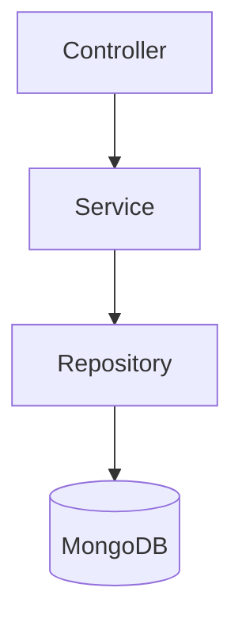

# Spring Boot Application

---

## Overview

This module demonstrates a basic Spring Boot application using MongoDB as the persistence layer.  
It focuses on a minimal service flow: request handling, business logic, and data persistence.

---

## Tech Stack

- Java
- Spring Boot
- MongoDB
- Maven

---

## Architecture (Low-Level)

The application follows a standard layered structure:

1. **Controller** → Handles incoming HTTP requests
2. **Service** → Contains business logic
3. **Repository** → Interacts with MongoDB
4. **Entity** → Represents MongoDB documents


## Key Components
### Controller
* Entry point for API requests
* Handles request/response mapping
* Keeps logic minimal

### Service
* Contains business logic
* Orchestrates calls to repository
* Keeps controller thin

### Repository
* Uses Spring Data MongoDB
* Provides CRUD operations
* Avoids boilerplate data access code

### Entity
* Represents document structure stored in MongoDB
* Annotated with @Document
* Maps Java objects to collections

Sample Implementations
## 1. MongoDB Connection Setup
* Steps for installing and configuring MongoDB locally:
  [Installation Instructions on Windows](later)

## 2. Products CRUD Operations
Basic CRUD operations using MongoDB:
* Create a new product
* Fetch all products
* Fetch a product by ID
* Update a product
* Delete a product

## 3. User Login / Logout
Basic authentication flow demonstrating:
* User persistence in MongoDB
* Simple login/logout handling 
* No token/session management (intentionally minimal)

## Dependencies
Spring Data MongoDB
```XML
<dependency>
<groupId>org.springframework.boot</groupId>
<artifactId>spring-boot-starter-data-mongodb</artifactId>
</dependency>
```

## Configuration
Typical application.yml setup:
```YAML
spring:
data:
mongodb:
uri: mongodb://localhost:27017/your-db-name
```

## How to Run
```bash
mvn spring-boot:run
```

## Notes
* This is a minimal implementation intended to show integration patterns.  
* No advanced security or validation is included.  
* Suitable as a base for extending into a production-ready service.